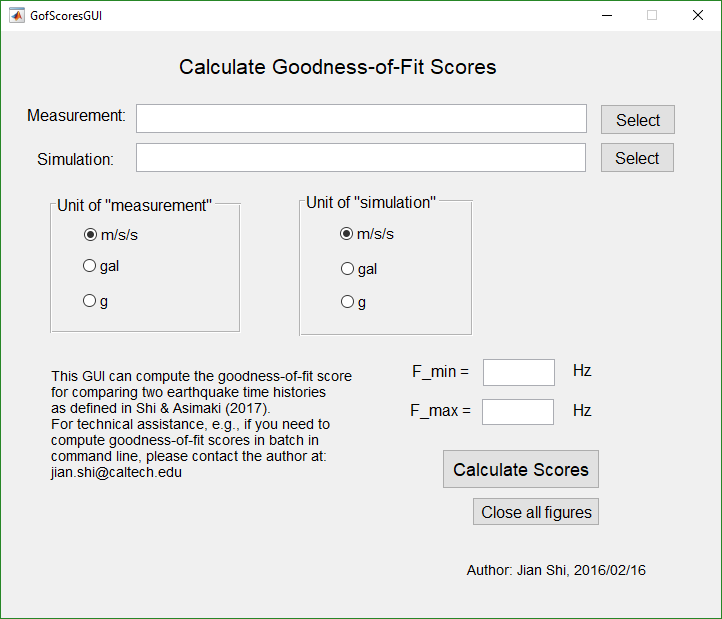
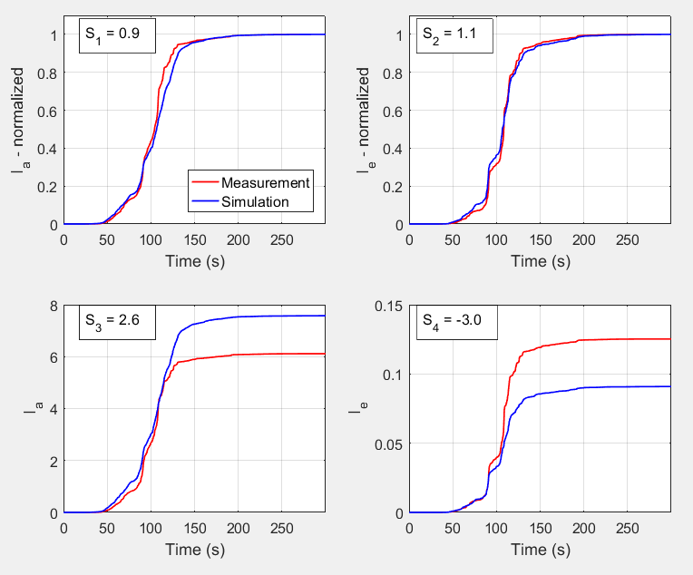
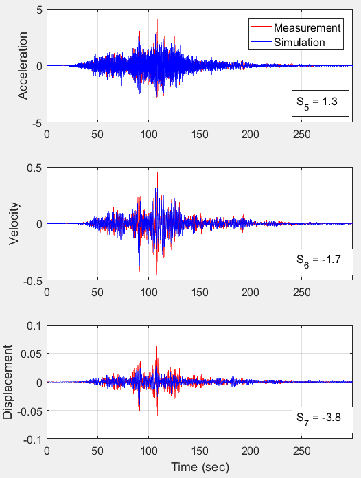
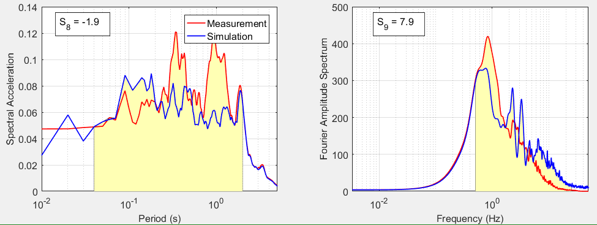
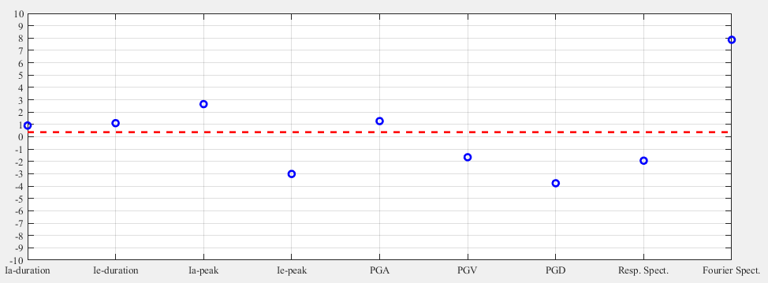

# GoF_score_GUI
A handy GUI to compute goodness-of-fit (GoF) score for earthquake ground motions

### What is goodness-of-fit score?
It describes how good a simulated earthquake ground motion ''agrees with'' recorded ground motion (which is considered the ''ground truth'', both literally and figuratively).

In other words, the higher the score, the better quality the simulated ground motion. Seismologists use this metric to evaluate their models.

### How is goodness-of-fit score calculated?
In particular for this GUI, the algorithm is described in [Shi & Asimaki (2017)](http://resolver.caltech.edu/CaltechAUTHORS:20170404-150827374) on Page 9.

### How to use this GUI?
Just download this repository, and in MATLAB, open `GofScoresGUI.m`. The user interface is very user-friendly and self-explanatory.

There are two `.txt` files (`FKSH141103111446.measurement.txt` and `FKSH141103111446.simulation.txt`) in the repository, which can be used as example ground motions as input. Note that the ground motion files should be text files with two columns (delimited by tabs, spaces, or commas), with the first column being time (in seconds) and the second column being ground acceleration (in gal, m/s/s, or _g_).

### Result

After clicking "Calculate Scores", four figures will pop out, which are comparisons and scores of the simulated time history and the measured time history.

The last figure shows each individual score (S1 to S9) as well as the average score (red dash line). The close the red line to zero, the better the prediction.

The score values are also displayed on the command window of MATLAB.

### To cite this work

If you wish to use this goodness-of-fit algorithm in your work, please cite this repository, as well as the following publication:

J. Shi, and D. Asimaki. (2017) "From stiffness to strength: Formulation and validation of a hybrid hyperbolic nonlinear soil model for site-response analyses." *Bulletin of the Seismological Society of America*. Vol. 107, No. 3, 1336-1355.

